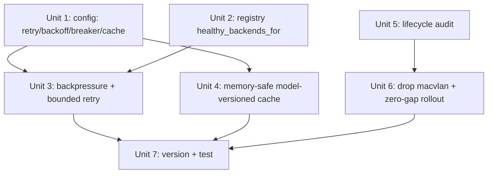

# Hide Backend Flakiness From Clients

## Overview

Make ollama-router absorb transient backend failures so clients see success
(or honest backpressure) instead of relayed HTTP 500s — **without amplifying
load on an already-struggling backend**. After a multi-persona review, the
core mechanism is reframed from "retry/failover" to **bounded retry-with-
backoff + a per-backend circuit breaker / admission control that sheds load as
429/503 + Retry-After rather than hammering**. The network change is simplified
to **dropping macvlan entirely** (Unit 6): the macvlan `.61` is a direct pod IP
that bypasses Traefik (so it never had per-request auth anyway), and removing it
consolidates access onto the existing forwardAuth'd `ollama.hr-home.xyz` route —
neutral-to-better security, no new L4/ipAllowList/NetworkPolicy surface — while
turning ollama-router into a plain ClusterIP Deployment that supports zero-gap
rollout (R8).

## Problem Frame

Clients (grepai bulk-embed + search, Hindsight) get intermittent HTTP 500s in
two windows: (1) ~60–75s after an ollama-router (re)start while the registry
re-discovers backends; (2) the embedder backend (llama-swap-cuda serving
`jina-code-embeddings`) 5xxs under sustained bulk load / model-swap, and
ollama-router relays the upstream status verbatim (`src/proxy.rs:73`). A single
relayed 500 aborts grepai's whole multi-minute index job.
(see origin: docs/brainstorms/2026-05-30-flakiness-mitigation-requirements.md)

**Review-corrected realities** (verified against the code + fleet manifests):
- `jina-code-embeddings` is **single-homed** on llama-swap-cuda → cross-backend
  failover cannot help the motivating case; the lever is same-backend
  retry-with-backoff + backpressure + cache.
- The failures are **correlated and can outlast a short retry budget** (bulk
  load), so blind fast retry both fails to help *and* amplifies load.
- The data plane has **no in-app auth**; auth is edge-only Traefik forwardAuth
  (`/auth` → `:9090`). Any network-layer change must preserve it (→ follow-up).

## Requirements Trace

- R1. *(reframed)* Prefer a different healthy backend for a model **only when
  one exists** (multi-homed); for single-homed models the mechanism is
  same-backend bounded retry — not failover.
- R2. When no backend is ready (post-start), hold/re-check within a bounded
  budget, then return **honest backpressure** (503 + Retry-After), not a 500.
- R3. Retry is bounded (attempts + latency budget) **with exponential backoff +
  jitter**, and gated by a **per-backend circuit breaker / in-flight cap** that
  sheds (429/503 + Retry-After) instead of piling onto a saturated backend.
- R4. Classify failures: retryable (connect-refused, 5xx, none-ready) vs fatal
  passthrough (4xx incl. 400 over-context). Treat **slow GATEWAY_TIMEOUT
  differently** from fast connect-refused (a timeout often means work in
  progress — do not blindly re-fire a full-timeout request).
- R5. Retry only before any client byte is sent; account for the
  `translate_proxy_response` layer (a 2xx that fails translation must not be
  mis-classified as success).
- R6/R7. Graceful lifecycle (drain + readiness) — **already largely implemented**
  (`main.rs:163-211`, `health_route`); audit/confirm only.
- R9/R10. *(re-scoped)* Embedding cache as a **search-latency optimization**
  (not a flakiness backstop): memory-safe (bytes-bounded, size-capped),
  **model-versioned** (survives alias remap), looked up **after auth**.
- R8. Zero-gap rollout — delivered by **dropping macvlan** (Unit 7): a plain
  ClusterIP Deployment can do `maxSurge:1/maxUnavailable:0` (new pod Ready
  before old terminates), with the Unit 3 drain + backpressure covering residue.

## Scope Boundaries
- NOT building a new LAN-restricted route — macvlan is simply dropped (Unit 6),
  access consolidates onto the existing forwardAuth'd `ollama.hr-home.xyz`.
- NOT fixing the `stuck-pod-pruner` churn (cluster-side) — but see Open
  Questions: it may be the dominant cause of restart-window 500s, so quantify it.
- NOT a 2nd always-on replica. NOT warm-start registry (#1) / heartbeat-hold (#3).
- NOT caching non-deterministic generations (chat with sampling).

## Context & Research

### Relevant Code and Patterns
- `src/proxy.rs::execute` — single forward path; reads upstream **status at
  line 73 before streaming** (retry-before-first-byte feasible), but **squashes
  connect/timeout errors into 502/504 Responses (53-71)**, losing the error
  kind the retry layer needs → must surface a structured outcome instead.
- `src/main.rs::model_route` (227; execute at 439; wraps result in
  `translate_proxy_response` 452/711-758) and `passthrough_route` (562; execute
  at 577, **no spill**). Embedding paths route through `model_route`.
- `src/spill.rs::spill_and_detect` — model_route **already spills the request
  body to a tempfile** and returns a replay stream → reuse it for retry replay;
  do NOT add a separate in-memory `Bytes` buffer for model_route.
- `src/registry.rs` — `lookup` is 1:1; `model_map` is first-writer-wins. New
  `healthy_backends_for(model)` will return a single backend for embedders.
- `src/main.rs:163-211` graceful SIGTERM drain + `health_route` (594) readiness
  gate already satisfy most of R6/R7.
- Auth: edge-only Traefik forwardAuth (`/auth` on `:9090`, main.rs:148/659);
  data plane has none.
- `src/config.rs:77 Config` — env-driven (`parse_env_u64(...)` + `Default`).

### Institutional Learnings
- `grepai-large-repo-embedder-tuning`: relayed 500 under bulk load is what broke
  grepai; over-context → **400** (must stay fatal); jina-code single-homed.
- Hindsight incident: an embedding **dimension change wiped memory_units** →
  cache MUST be model-versioned and flushed on model change.
- `feedback_multus_sandbox_drop`, macvlan `.61` reservation → relevant to the
  follow-up migration, not here.

## Key Technical Decisions
- **Backpressure over blind retry.** The dominant failure is correlated
  saturation; the safe response is to *shed* (429/503 + Retry-After) and let
  grepai pace itself, with bounded retry-with-backoff for *transient* blips only.
- **Circuit breaker / per-backend in-flight cap.** Prevents the 3× retry-storm
  the review identified; when a backend is tripped, requests get fast 503 +
  Retry-After, not more load.
- **Same-backend retry for single-homed models**; cross-backend failover only
  when `healthy_backends_for` returns >1.
- **Structured proxy outcome** (status + error kind) so `classify` distinguishes
  connect-refused (cheap retry) from slow-timeout (do not re-fire).
- **Reuse the spill tempfile** for model_route retry replay (no double-buffer);
  buffer-to-Bytes only for `passthrough_route`.
- **Cache is memory-safe + model-versioned + post-auth**, and re-scoped to
  search latency. Bytes-bounded (moka weigher) + max-cacheable-size (skip the
  ~22 MB bulk embeds), key = `(model, model_epoch, blake3(body_bytes))`, flushed
  on backend rediscovery. Reconcile with the **256Mi pod memory limit**.
- **Drop macvlan entirely (Unit 7); no replacement LAN route.** The macvlan
  `.61` is a *direct pod IP that bypasses Traefik* — it never had forwardAuth,
  so its profile is "LAN-reachable, no per-request auth". The review's auth-drop
  P0 compared against the wrong baseline (the separate `ollama.hr-home.xyz`
  forwardAuth route, which stays). Removing macvlan and pointing the few
  direct-`.61` consumers (emacs gptel) at the **existing forwardAuth'd
  `ollama.hr-home.xyz` route** is neutral-to-*better* security and deletes the
  L4/ipAllowList/trusted-proxy/NetworkPolicy complexity. ollama-router becomes a
  plain ClusterIP Deployment → `maxSurge:1/maxUnavailable:0` zero-gap rollout
  (R8) is delivered.

## Open Questions

### Resolved During Planning
- *Retry vs backpressure (R3)*: bounded retry (≤2) **with backoff+jitter** for
  transient blips; circuit-breaker trips to 503+Retry-After under sustained 5xx.
- *Body replay (R5)*: reuse spill tempfile (model_route); Bytes (passthrough).
- *Cache safety (R9)*: bytes-bounded + size cap + model-epoch key + post-auth.

### Deferred to Implementation / Needs Research
- *[Needs research]* **Verify the retry budget vs the real 5xx stall-duration
  distribution** — if windows exceed the budget, lean harder on backpressure.
- *[Needs research]* **Quantify what fraction of restart-window 500s come from
  `stuck-pod-pruner` kills** vs backend load — determines how much this plan can
  actually move the needle on window (1).
- *[Technical]* Circuit-breaker thresholds, in-flight cap, backoff curve,
  cache bytes-budget + max-cacheable-size + epoch source (backend-reported
  model fingerprint vs config epoch).
- *[Technical]* Where `classify` sits relative to `translate_proxy_response`.

## High-Level Technical Design

> *Directional guidance for review, not implementation specification.*

```
request → handler (model_route / passthrough_route)
  ├─ [#5] embeddings & deterministic & ≤size_cap?  (AFTER auth)
  │        → cache.get((model, model_epoch, hash)) ─ hit → 200 cached
  ├─ candidates = registry.healthy_backends_for(model)   # ≥1; usually 1 for embedders
  ├─ if breaker(open for all candidates) → 503 + Retry-After   # shed, don't pile on
  └─ attempt loop (≤max_retries, within budget, backoff+jitter):
        outcome = proxy::try_once(body_replay, backend)        # structured: status|err-kind
        match classify(outcome):
          Fatal(4xx)                 → return                  # 400 over-context never retried
          Success(2xx, pre-translate)→ [#5] maybe cache; return (after translate)
          ConnectRefused / 5xx / none-ready → record breaker; backoff; next attempt
          SlowTimeout                → record breaker; do NOT immediately re-fire same backend
     exhausted → 503 + Retry-After (backpressure), not a relayed 500
```

## Implementation Units



- [ ] **Unit 1: Config — retry/backoff/breaker + cache knobs**

**Goal:** Env-driven config for the new mechanisms.
**Requirements:** R3 (cache-config values support R10, owned by Unit 4)
**Dependencies:** none
**Files:** Modify `src/config.rs`
**Approach:** Add `max_retries` (default 2), `retry_backoff_base_ms`/`jitter`,
`retry_latency_budget_secs`, `breaker_5xx_threshold` + `breaker_open_secs`,
`backend_max_inflight`, `cache_enabled` (default **false** until validated),
`cache_max_bytes`, `cache_max_entry_bytes` (skip large embeds), `cache_ttl_secs`.
Mirror existing `parse_env_u64` + `Default`.
**Test scenarios:** Happy: defaults when unset; parsed when set. Edge: garbage →
default (matches `parse_env_u64`).
**Verification:** `cargo test` config parse; fields reachable in `AppState`.

- [ ] **Unit 2: Registry — healthy_backends_for(model)**

**Goal:** Enumerate healthy backends serving a model (for the rare multi-homed
case), primary first.
**Requirements:** R1
**Dependencies:** none
**Files:** Modify `src/registry.rs`; tests in-file.
**Approach:** `healthy_backends_for(&self, model) -> Vec<BackendId>` (exact then
`:`-prefix; primary from `model_map` first; unhealthy excluded). Keep `lookup`.
**Patterns to follow:** `lookup` (114), `rebuild_model_map` invariant (82-86).
**Test scenarios:**
- Happy (real case): single-homed model → **exactly one** backend (primary test).
- Edge: multi-homed → both, primary first; unhealthy serving backend → excluded;
  absent model → empty.
**Verification:** returns 1 for embedders; ordering/filtering correct.

- [ ] **Unit 3: Backpressure + bounded retry-with-backoff + circuit breaker**

**Goal:** Convert transient blips to successes via bounded backoff retry, and
sustained saturation to honest 503+Retry-After — **without amplifying load**.
**Requirements:** R1, R2, R3, R4, R5
**Dependencies:** Unit 1, Unit 2
**Files:** Modify `src/proxy.rs` (surface structured outcome instead of pre-built
502/504; keep streaming for the final success), new `src/resilience.rs`
(breaker + in-flight cap + retry loop), `src/main.rs` (`model_route` 439,
`passthrough_route` 577); tests in `src/resilience.rs` + `src/proxy.rs`.
**Approach:** Change `execute` to return `Result<Response, ProxyError{kind}>`
(or a `ProxyOutcome`) so the caller sees connect-refused vs timeout vs status.
Retry loop: backoff+jitter between attempts, within latency budget; per-backend
**circuit breaker** opens after N consecutive 5xx and trips new requests to
**503 + Retry-After**; a **per-backend in-flight cap** sheds (503) rather than
queueing unboundedly. For `model_route`, replay the request from the **existing
spill tempfile** (re-seek per attempt); `passthrough_route` buffers to Bytes
(≤cap; over cap → single-shot). Retry only before first client byte; classify
runs on the pre-translate status, and a post-`translate_proxy_response` 502 is
also treated as a (bounded) retryable outcome.
**Execution note:** Failing test first — "backend 500 then 200 within budget →
client 200" and "5 concurrent 5xx → breaker opens → further requests get 503,
backend not hammered".
**Patterns to follow:** existing `execute` error arms (proxy.rs:53-71) become
typed; streaming success path unchanged.
**Test scenarios:**
- Happy: first attempt 200 → no retry, zero added latency.
- Error→recover: 500 then 200 within budget → client 200 (R1/R3).
- Fatal: 400 over-context → returned immediately, never retried (R4).
- **Retry-storm guard:** burst of concurrent 5xx → breaker opens, subsequent
  requests get 503+Retry-After, total backend requests bounded (R3) — the
  central new test.
- Slow timeout: GATEWAY_TIMEOUT → not immediately re-fired at same backend (R4).
- Body: model_route replays from tempfile (no extra heap); passthrough over cap
  → single-shot.
- Translation: 2xx that fails `translate_proxy_response` → not cached, bounded
  retry, not mis-reported as success (R5).
- Integration: none-ready at request time → 503+Retry-After, not 500 (R2).
**Verification:** transient blip → 200; sustained saturation → 503+Retry-After
with bounded backend load; 400s pass through; healthy latency unchanged.

- [ ] **Unit 4: Memory-safe, model-versioned embedding cache** *(optional / lower priority — search-latency optimization, not flakiness backstop)*

**Goal:** Serve repeated *small* identical embedding requests from cache, safely.
**Requirements:** R9, R10
**Dependencies:** Unit 1
**Files:** Create `src/cache.rs`; modify `src/main.rs` (embeddings branch,
**after auth**), `src/lib.rs`, `Cargo.toml` (`moka` async + `blake3`); tests in-file.
**Approach:** `moka::future::Cache` bounded by **total bytes** (weigher on body
len) + `time_to_live`; **skip** bodies above `cache_max_entry_bytes` (the ~22 MB
bulk embeds — never buffer those). Key = `(model, model_epoch,
blake3(raw_body_bytes))`; `model_epoch` derived from backend-reported model
identity / config epoch and **flushed on backend rediscovery** so an alias
remap can't serve stale vectors. Lookup occurs **after** the (edge) auth path.
Default `cache_enabled=false` until validated; reconcile `cache_max_bytes` with
the **256Mi pod limit** (and/or raise the limit in the manifest).
**Test scenarios:**
- Happy: identical small request twice → 2nd from cache, no backend call.
- **Memory:** body > entry cap → not cached (no 22 MB buffering); total bytes
  bounded by `cache_max_bytes`.
- **Staleness:** model_epoch change / rediscovery → old entries not served.
- Error path: non-2xx → not cached. Disabled flag → always proxy.
- Distinct (model|input|epoch) → distinct keys, no collision.
**Verification:** repeated small query served from cache; memory provably
bounded; no stale vectors across model change; lookup never precedes auth.

- [ ] **Unit 5: Lifecycle drain + readiness audit (app-side)**

**Goal:** Confirm graceful drain + readiness so a terminating pod finishes
in-flight work and leaves rotation first.
**Requirements:** R6, R7
**Dependencies:** none
**Files:** Modify `src/main.rs` only if a gap is found; handler test.
**Approach:** Audit the existing SIGTERM drain (163-211) + readiness gate (594):
confirm in-flight survives SIGTERM and readiness flips 503 promptly on shutdown.
**Test scenarios:** Integration: request in flight at SIGTERM drains, not
dropped. Edge: `/health` 503 before first discovery / during shutdown, 200 only
when a backend is healthy.
**Verification:** local SIGTERM drains cleanly; readiness reflects state.

- [ ] **Unit 6: Drop macvlan + enable zero-gap rollout** *(fleet manifest)*

**Goal:** Remove the pinned-macvlan-IP constraint so the Deployment can roll
with zero gap; consolidate access onto the existing forwardAuth'd route.
**Requirements:** R8
**Dependencies:** Unit 5 (drain/readiness proven before enabling surge)
**Files:** Modify `hr-fleet:fleet/ai/ollama-router.yaml` (remove the
`k8s.v1.cni.cncf.io/networks` macvlan annotation + the `.61` IP; ensure a
ClusterIP Service; set `strategy: RollingUpdate` `maxSurge:1`
`maxUnavailable:0`; keep `terminationGracePeriodSeconds` ≥ in-flight time;
preserve the existing `ollama.hr-home.xyz` IngressRoute + forwardAuth — that
route already targets the Service). No ollama-router code change. No new route,
no ipAllowList/L4 — the existing L7 forwardAuth route is the access path.
**Approach:** Drop macvlan → pods stop pinning `.61` → `maxSurge:1` brings a new
Ready pod up before the old terminates (true zero-gap, paired with the Unit 5
drain). Direct-`.61` LAN consumers (emacs gptel) re-point to
`https://ollama.hr-home.xyz` + their api_key (forwardAuth) — neutral-to-better
security vs the old unauth'd direct path. Confirm the existing IngressRoute
targets the ClusterIP (not the macvlan IP) and re-point if needed. **Verify**
the long-standing assumption that the L7 route handles the ~22 MB embedding
responses fine (it does — they already transit it today; Traefik doesn't buffer
response bodies by default).
**Execution note:** Fleet manifest only. Pause the `ai` Fleet bundle during
cutover (`feedback_pause_bundle_for_maintenance`); confirm `ollama.hr-home.xyz`
keeps resolving; free/repurpose the `.61` reservation + any fleet-dns mapping.
**Patterns to follow:** inverse of the `lan-macvlan` NAD annotation; existing
`ollama.hr-home.xyz` IngressRoute + `ollama-auth`/`umami-feed` middlewares.
**Test scenarios:**
- Integration: rolling restart → continuous client requests see no 5xx gap.
- Integration: `ollama.hr-home.xyz` still serves (with api_key) post-cutover;
  a `.61`-direct call no longer resolves.
- Edge: no residual macvlan annotation; pod schedules without the `lan-macvlan`
  NAD; readiness 75s floor retained (rollout ~75–90s/pod but gap-free).
**Verification:** rollout produces zero client-visible error window; no
`FailedPreStopHook`; `.61` freed; no off-cluster consumer left on the raw IP.

- [ ] **Unit 7: Version bump + full test pass**

**Goal:** Ship-ready build.
**Requirements:** all
**Dependencies:** Units 1-6
**Files:** `Cargo.toml` (0.10.2 → 0.11.0); ollama-router image tag in the fleet
manifest.
**Approach:** Bump minor; build/test via `./test.sh`; push via `build.sh`.
**Test expectation:** none new — runs Units 1-5 suite.
**Verification:** `./test.sh` green; tag pushed; manifest references it.

## System-Wide Impact
- **Interaction graph:** resilience wrapper around both proxy call sites; cache
  in front of the embeddings branch, post-auth.
- **Error propagation:** 4xx (esp. 400) terminal; exhaustion → 503+Retry-After
  (not relayed 500); breaker-open → fast 503.
- **State lifecycle:** breaker + in-flight counters are per-backend in-memory;
  cache bytes-bounded, model-versioned, flushed on rediscovery.
- **Unchanged invariants:** streaming success path, translation, edge auth,
  heartbeat/cold-load — untouched (cache buffers only small embeds, never the
  streamed 22 MB ones).

## Risks & Dependencies

| Risk | Mitigation |
|------|------------|
| Retry amplifies load on a saturated backend | Circuit breaker + in-flight cap + backoff; shed as 503+Retry-After (Unit 3) |
| Per-request retry can't fix correlated multi-minute saturation | Backpressure lets grepai pace itself; validate budget vs stall duration (Open Q) |
| Cache buffers 22 MB bodies → OOM under 256Mi limit | Bytes-bounded + max-entry-size skip; `cache_enabled=false` default |
| Stale vectors after model/alias change | Model-epoch in key + flush on rediscovery (Hindsight dim-change precedent) |
| Failover assumed but embedders single-homed | Reframed: same-backend retry + cache; failover only if >1 backend |
| Restart-window 500s driven by pruner (out of scope) | Quantify contribution (Open Q); link the separate pruner effort |
| macvlan-drop cutover breaks a `.61`-pinned consumer | Audit/re-point off-cluster consumers (emacs gptel) to `ollama.hr-home.xyz`+api_key first; pause `ai` bundle during cutover |
| Existing L7 route can't handle 22 MB embed responses | Verify (it already serves them today; Traefik doesn't buffer response bodies by default) |
| New deps (moka, blake3) | Small, maintained; cache off by default |

## Sources & References
- **Origin:** [docs/brainstorms/2026-05-30-flakiness-mitigation-requirements.md](docs/brainstorms/2026-05-30-flakiness-mitigation-requirements.md)
- Code: `src/proxy.rs` (execute/status 73, error squash 53-71), `src/main.rs`
  (model_route 227/439, translate 711-758, passthrough 577, shutdown 163-211,
  health 594, auth 148/659), `src/spill.rs` (spill_and_detect), `src/registry.rs`
  (lookup 114), `src/config.rs`
- Memories: `grepai-large-repo-embedder-tuning`, `feedback_multus_sandbox_drop`
- Review (2026-05-30): reframed retry→backpressure, split network migration,
  fixed cache memory/staleness, corrected single-homed-failover + auth-drop.
